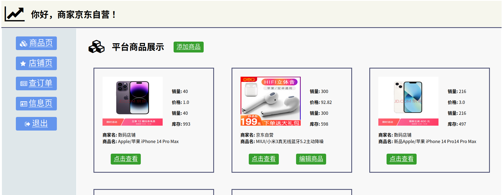

# ruby大作业文档-20373363-李子涵
## 一、实体说明

一共包含八个实体：

- 用户表：id, 用户名，密码，角色（买家/商家）
- 产品表：id, 商家id，名称，描述，价格，库存，图片路径
- 商品评论表：id，用户id，商品id，评论内容，评价时间
- 购物车表：买家id，产品id，数量
- 收货人信息表：id，用户id，收货人姓名，收货地址，收货电话
- 订单表：id，用户id，商家id，下单时间，订单状态，订单收货人姓名，订单收货地址，订单收货电话
- 订单项表：产品id，订单id，下单时产品名，下单时产品单价，产品数量
- 收藏夹表：买家id，产品id，添加时间

## 二、实现功能

### （一）商家、用户共有的页面展示、功能介绍

#### 1.1【登陆注册页面】

- 通过session控制器实现登陆注册功能

- 注册时区分商家和买家

- 登录只用输入用户名和密码，不需要输入身份，可自动进入买家或者商家界面

- 对于用户和商家，在外模式、数据视图、增删改查权限方面，存在权限区别

#### 1.2【商品页】平台所有商品目录界面

- 查看其他所有商家发布的产品

- 只能添加/编辑/删除商家自己发布的产品，对其他商家的商品，不具有修改和删除权限，只有查看权限

- 商家在商品页可以添加商品，买家的商品页只能查看，不能增加商品

#### 1.3【订单展示页】

- 用户下单时，**会自动将购物车内属于同一个店家的所有商品**，生成一个订单。

- 订单会展示商家信息、用户收货信息、订单的每一件商品

- 订单的状态：订单未付款--> 用户点击付款 --> 订单未发货 --> 商家点击发货  --> 用户点击收货 --> 订单完成
- 或者用户选择退款，订单状态变为用户已退款，然后商家和用户可以选择删除订单或者继续保留订单在页面

- 用户可以查看每一张订单的商家

#### 1.4【商品详情展示页】

- 对于商家自己的商品，可以编辑商品和删除商品

- 对于不属于此商家的商品，商家与用户在商品详情展示页的权限相同

- 查看所有人发布的所有评价列表

- 对商品发布新评价

- 修改/删除自己发布的评价

### （二）商家特殊界面展示、功能介绍
#### 2.1【店铺页】商家的店铺商品管理页面，能查看/修改自己的商品

- 增删改查商家的所有商品

### （三）用户特殊界面展示、功能介绍

#### 3.1 【购物车】

- 购物车页面，可以编辑商品数量，或者删除购物车的商品

#### 3.2 【下单页面】

- 用户下单时，**会自动将购物车内属于同一个店家的所有商品**，生成一个订单。

- 用户下单时，可以从已经有的收货人信息卡片中选择一个收货人信息（姓名、地址、手机号）下单。

- 也可以在这个页面跳转到新建/修改个人信息的页面

#### 3.3 【用户信息页面】

- 新建/修改/删除收货人的信息卡片

- 修改用户名/密码

#### 3.4 【收藏夹页面】

- 添加产品到收藏夹

- 浏览收藏夹

- 将产品从收藏夹内删除

